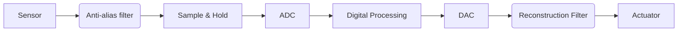

# SAR ADC Design Project: Theory & Fundamentals

## 1. Introduction to Data Conversion

### Why Do We Need Data Converters?

The physical world is **analog**. Signals like temperature, pressure, sound, and velocity are continuous. To measure these, we use **transducers**, which convert a physical signal into an electrical (analog) signal.

However, analog signals have significant drawbacks:
* **Susceptible to Noise:** Any interference can easily corrupt the signal.
* **Difficult to Process:** Complex operations like filtering or analysis are complex to implement in the analog domain.
* **Difficult to Store:** Storing an analog value (like a specific voltage) accurately over time is very challenging.

This is why we convert them into the **digital domain**. Digital signals are robust, easy to process with CPUs/DSPs, and can be stored perfectly (as 1s and 0s) without loss.

### The Complete Signal Chain

The process of moving between the analog and digital worlds relies on two key components: the **ADC** and the **DAC**.

* **Analog-to-Digital Converter (ADC):** Converts a real-world analog voltage into a digital number.
* **Digital-to-Analog Converter (DAC):** Converts a digital number back into an analog voltage.

A typical data processing system looks like this:

1.  **Analog Signal:** The real-world physical quantity (e.g., sound).
2.  **Transducer:** A microphone converts the sound into an analog electrical signal.
3.  **ADC:** The ADC samples and quantizes this electrical signal, turning it into a stream of digital bits.
4.  **Digital Processing:** A Digital Signal Processor (DSP) or microcontroller processes these bits (e.g., applies a filter, compresses the data).
5.  **DAC:** The processed bits are sent to a DAC to convert them back into an analog electrical signal.
6.  **Actuator:** An analog component (like a speaker) uses this signal to reproduce the original sound.
---

## High-level ADC/DAC Block Diagram

## 2. Basic Concepts

### 2.1 Analog vs. Digital Signals

* **Analog Signals:** An analog signal is **continuous** in both time and amplitude. It can have an infinite number of values within a given range (e.g., the voltage from a microphone, which can be 1.1V, 1.101V, 1.101001V, etc.).
    * **Advantages:** Represents the "real world" perfectly; high resolution.
    * **Disadvantages:** Highly susceptible to noise, difficult to store perfectly, and complex to process.

* **Digital Signals:** A digital signal is **discrete** in both time and amplitude. It is represented by a sequence of numbers (usually binary 0s and 1s).
    * **Advantages:** High noise immunity, perfect storage and replication, and easy to process with computers.
    * **Disadvantages:** The conversion from analog introduces **quantization error**, meaning some information is always lost.

  

### 2.2 Sampling

Sampling is the first step in A/D conversion. It's the process of converting a continuous-time analog signal into a discrete-time signal by taking "snapshots" of it at regular intervals.

* **Sampling Theorem (Nyquist-Shannon Theorem):** To perfectly reconstruct an analog signal, the sampling frequency ($F_s$) must be at least **twice** the highest frequency component ($F_{max}$) in the signal.
    * **Formula:** $F_s \ge 2 \cdot F_{max}$
* **Aliasing:** If you sample too slowly ($F_s < 2 \cdot F_{max}$), higher frequencies "fold down" and disguise themselves as lower frequencies, causing distortion. This is called aliasing.
    
* **Anti-Aliasing Filter:** To prevent aliasing, we always use a **Low-Pass Filter (LPF)** before the ADC. This filter cuts off any frequencies *above* $F_{max}$ (usually $F_s / 2$) to ensure the Nyquist criterion is met.

### 2.3 Quantization

Quantization is the second step. It's the process of mapping the *infinite* possible values of the sampled analog signal to a *finite* set of discrete levels.

* **Quantization Levels:** For an **n-bit** ADC, you have $2^n$ available levels.
    * *Example:* A 3-bit ADC has $2^3 = 8$ levels.
* **LSB (Least Significant Bit):** This is the smallest change the ADC can detect. It's the voltage step size between two adjacent levels. It defines the ADC's **resolution**.
    * **Formula:** $\text{LSB} = \frac{V_{FSR}}{2^n}$
    * $V_{FSR}$ is the Full-Scale Range (e.g., $V_{ref\_max} - V_{ref\_min}$).
    * *Example:* For a 3-bit ADC with a 10V $V_{FSR}$, the $\text{LSB} = \frac{10\text{V}}{2^3} = \frac{10\text{V}}{8} = 1.25\text{V}$.
* **Quantization Error:** This is the inherent error introduced by this "rounding" process. It's the difference between the actual analog input and the quantized level.
    * The maximum error is always $\pm 0.5 \text{ LSB}$. This is an unavoidable part of A/D conversion.

    

  

### 2.4 Encoding

Encoding is the final step. Each discrete quantization level is assigned a unique **binary code**.

* **Binary Representation:** The $2^n$ levels are typically represented by an n-bit binary number.
    * *Example:* For our 3-bit, 8-level ADC:
        * Level 0 (0V) $\rightarrow$ `000`
        * Level 1 (1.25V) $\rightarrow$ `001`
        * ...
        * Level 7 (8.75V) $\rightarrow$ `111`
* **MSB (Most Significant Bit):** The first bit, which represents the largest voltage step (in a SAR ADC, this is $V_{FSR} / 2$).
* **LSB (Least Significant Bit):** The last bit, which represents the smallest voltage step (the resolution).

  > simple [matlab code](https://github.com/ShravanaHS/sar-adc-cadence-virtuoso/edit/main/codes) to simulate these 4 steps

## 3. Sample and Hold (S/H) Circuit

### 3.1 Why is an S/H Circuit Needed?

An ADC takes a finite amount of time to perform its conversion (this is the "Conversion Time"). For our SAR ADC, this is $N$ clock cycles.

If the analog input voltage **changes** during this conversion time, the ADC will be confused. It might compare the input against the MSB at one voltage (e.g., 5.1V) and against the LSB at another (e.g., 5.6V). This leads to a completely incorrect digital code.

The **Sample and Hold (S/H) circuit** solves this. Its job is to:
1.  **Sample:** "Track" the analog input.
2.  **Hold:** "Freeze" the voltage at a specific instant and hold it perfectly steady, giving the ADC a stable input to convert.

It sits directly at the input of the ADC.

### 3.2 Block Diagram

There are two main architectures.

**1. Basic (Open-Loop):**
This is the simplest form, consisting of just a switch and a capacitor.
`Vin --> [Switch] --> [Hold Capacitor, Ch] --> Vout (to ADC)`

**2. Buffered (Closed-Loop):**
This is a more practical design. Your notes mentioned this using op-amps (buffers) to solve impedance problems.
* The first buffer gives a low **source impedance**, allowing it to drive the hold capacitor $C_h$ quickly.
* The second buffer provides a high **input impedance**, which prevents the ADC from "sucking" charge out of the capacitor. This minimizes **droop**.

`Vin --> [Buffer 1] --> [Switch] --> [Hold Capacitor, Ch] --> [Buffer 2] --> Vout (to ADC)`

### 3.3 Components

* **MOS Switch:** A simple CMOS transistor (or transmission gate) acts as the electronic switch. When `ON` (Sample mode), it has a low resistance. When `OFF` (Hold mode), it has a very high resistance.
* **Hold Capacitor ($C_h$):** This is the most critical component. It's the "bucket" that stores the analog voltage.
* **Buffers:** (Usually op-amps) Used to isolate the capacitor from the input and output.

### 3.4 Key S/H Parameters

These specifications (from your notes) define how well the S/H circuit works.

* **Acquisition Time:** The time required (after the switch turns ON) for the hold capacitor $C_h$ to charge up to the input voltage $V_{in}$ within a specified error (e.g., within 0.5 LSB). This depends on the switch's `ON` resistance and the size of $C_h$.
* **Aperture Time:** The time delay between when the "Hold" command is given and when the switch *actually* opens.
* **Hold Mode Settling Time:** The time it takes for the output to settle to its final value after the switch opens.
* **Hold Step (or Pedestal Error):** When the switch turns OFF, it "injects" a small amount of charge ($Q$) from its channel into the capacitor. This causes a small, abrupt voltage error.
    * **Formula:** $\Delta V = Q / C_h$
* **Droop Rate:** The "leaking" of voltage from the capacitor when in Hold mode. This is caused by tiny leakage currents from the `OFF` switch and the buffer's input.
    * **Formula:** $\text{Droop Rate} = I_{\text{leakage}} / C_h$
    * **Critical Project Goal:** The total voltage droop during one *full ADC conversion* must be less than 0.5 LSB.
* **Feedthrough:** The fraction of the input signal that "leaks" through the `OFF` switch and appears at the output.

### 3.5 S/H Design Challenges

There is a fundamental trade-off in choosing the capacitor size $C_h$:

* **Large $C_h$:**
    * **Good:** Low droop rate, small hold step (error).
    * **Bad:** Long acquisition time (slow), requires a strong input buffer.
* **Small $C_h$:**
    * **Good:** Very fast acquisition time.
    * **Bad:** High droop rate, large hold step (error).

The design challenge is to pick a $C_h$ that is **just large enough** to keep the droop rate below 0.5 LSB for our ADC's total conversion time, while still being **small enough** to meet our speed (sampling rate) target.
